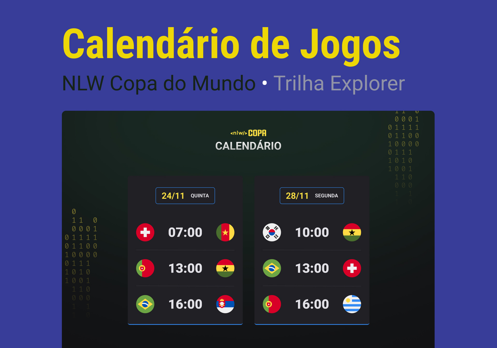
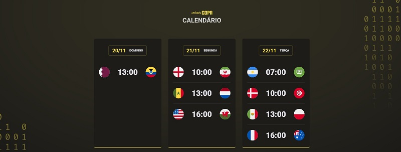

<h1 align="center"> NLW #10 - Copa do Mundo </h1>

Evento exclusivo e gratuito, promovido ♥ by <a href="https://www.rocketseat.com.br">Rocketseat </a> para ensino de tecnologias WEB.

  <a href="#-tecnologias">Tecnologias</a>&nbsp;&nbsp;&nbsp;|&nbsp;&nbsp;&nbsp;
  <a href="#-projeto">Projeto</a>&nbsp;&nbsp;&nbsp;|&nbsp;&nbsp;&nbsp;
  <a href="#-layout">Layout</a>&nbsp;&nbsp;&nbsp;|&nbsp;&nbsp;&nbsp;
  <a href="#memo-licença">Licença</a>

  

 
 
  <h2 align="center"> Deploy: <a href="https://cardpay-lab.vercel.app/"> Calendario Copa do Mundo</a> </h2>
 
 

  

 

  

 

## 🚀 Tecnologias

Esse projeto foi desenvolvido com as seguintes tecnologias:

- HTML e CSS
- JavaScript
- Git e Github

## 💻 Projeto

O Calendário da Copa do Mundo é um projeto que mostra os jogos da Copa de 2022.

## 🔖 Layout

Você pode visualizar o layout do projeto através [DESSE LINK](<https://www.figma.com/file/2GPIXtIC6QLIjnhm2ldIYV/Calend%C3%A1rio-de-Jogos-(Community)>). É necessário ter conta no [Figma](https://figma.com) para acessá-lo.

## :memo: Licença

Esse projeto está sob a licença MIT.

---

:wave: [Participe da comunidade!](https://discord.gg/rocketseat)
